# ドメイン参加端末のWindows Hello利用方法

# 実現したいこと

ドメイン参加のPC（ADに参加しているPC）において、Windows Hello（顔認証、指紋認証、PIN）を利用したい。

既定では、ドメイン参加のPCにおいて、Windows Helloの設定画面はグレーアウトしており利用できない。

# 用語

Windows Hello　＝　便利なPIN

# 手順

GPO（グループポリシーオブジェクト）を利用し、Windows Helloを利用する。

## GPOを適用するためのOU作成

ツール＞ユーザとコンピュータ

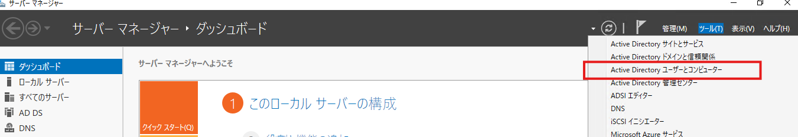

操作＞新規作成＞組織単位（OU）

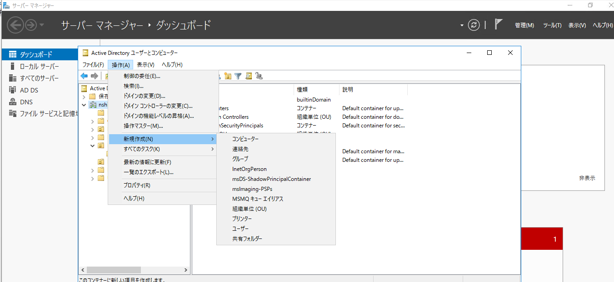

名前を付ける

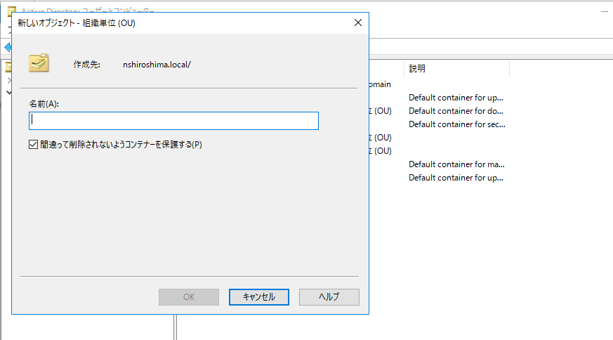

適用したいコンピュータオブジェクト（ONPRE-WIN11-1）を作成したOU（LocalOU）へ移動させる

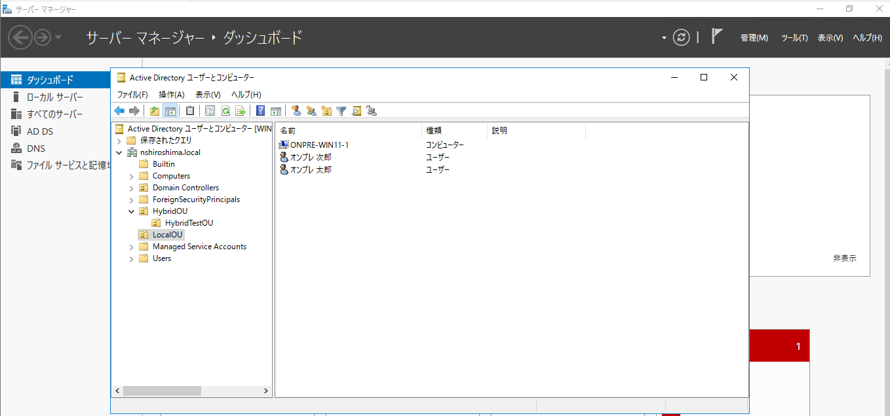

## GPO作成

ツール＞グループポリシー管理

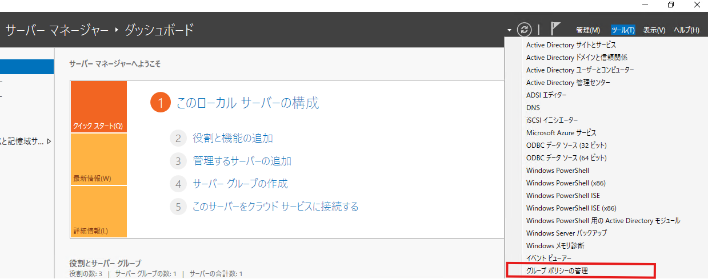

グループポリシーオブジェクト＞右クリック＞新規＞

名前を付ける

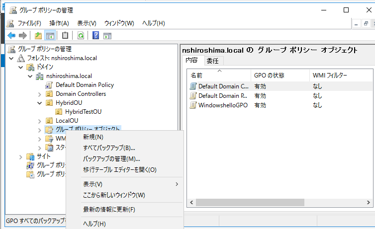

右クリック＞編集

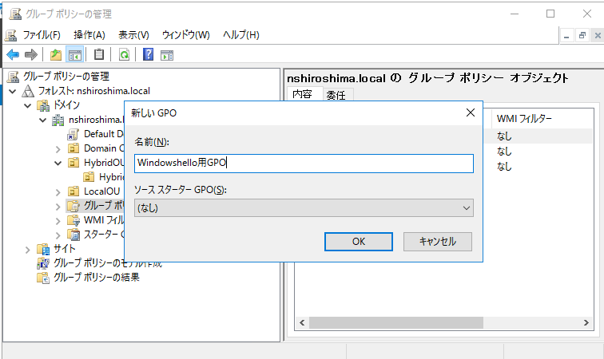

コンピュータの構成＞ポリシー＞管理用テンプレート＞システム＞ログオン＞便利なPINを使用したサインインをオンにする

<aside>
💡

コンピュータの構成のグループポリシーであることから、ユーザ単位ではなく、コンピュータ単位で有効になります

</aside>

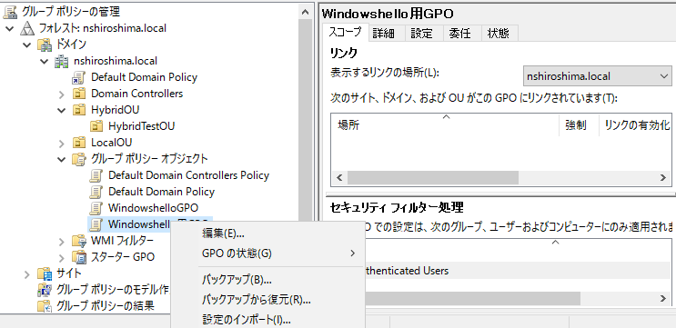

デフォルトは未構成であるため、「有効」をクリックし、適用

※ヘルプに記載の通り、無効もしくは未構成の場合、Windows hello(便利なPIN)は設定できない。

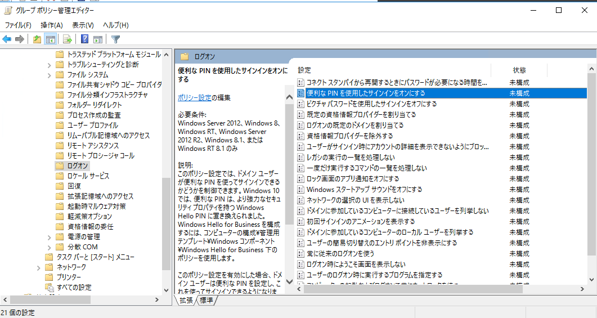

有効となったことを確認

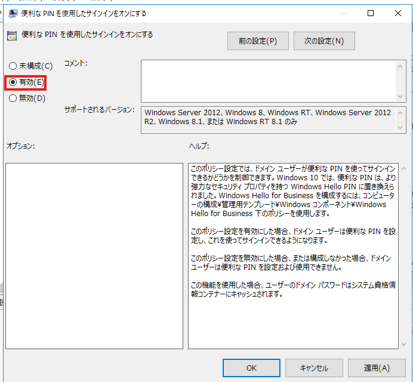

グループポリシーの管理の画面に戻り、作成したGPOを適用したいOU（LocalOU）へドラック。

確認画面が表示されるので、OKをクリック

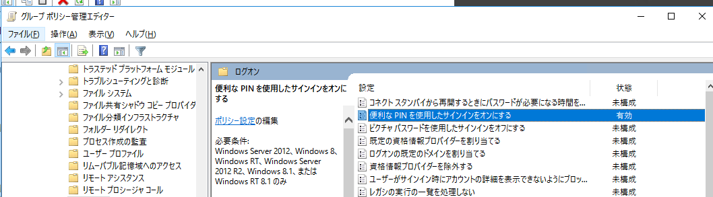

作成したGPOが、LocalOUの配下に入ったことを確認

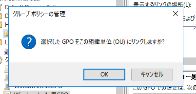

# 検証結果

起動した際はパスワードでPCログオン。

端末を起動したときにHelloを登録することを強制されるわけではなく、設定画面からのセットアップできるようになる形。

設定＞アカウント＞サインインオプション

※今回は仮想マシンとして作成しており、顔・指紋は利用できないがPINが利用できる

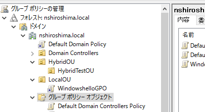

デフォルトのPIN要件が設定されています。（詳細は後述）

PINを設定します。

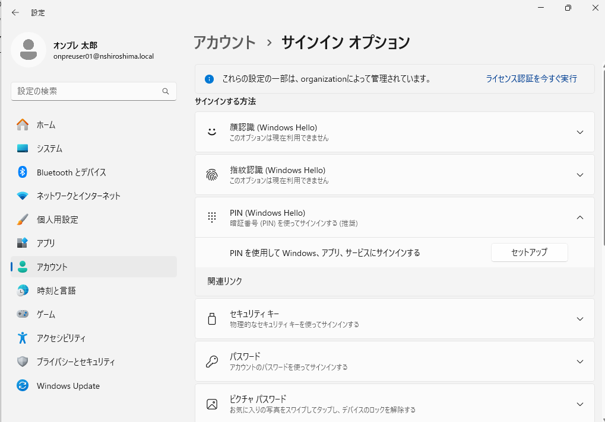

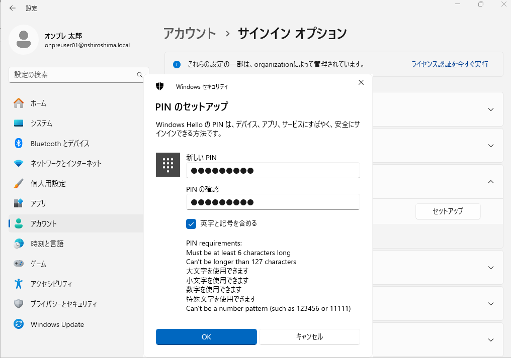

一度PCからサインアウトすると、サインインオプションとしてPINが選択できるようになります！

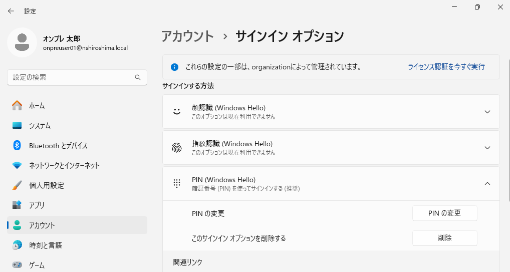

# おまけ　PINの複雑さについて

上記ではPINのポリシーはデフォルトの設定になっていました。

デフォルトの設定値はこちらに記載

[Windows Hello for Business ポリシー設定 | Microsoft Learn](https://learn.microsoft.com/ja-jp/windows/security/identity-protection/hello-for-business/policy-settings?tabs=pin#tabpanel_1_pin)

カスタムしたい場合は、PINの複雑さに関するGPOを作成して設定できます。

コンピュータの構成＞ポリシー＞管理用テンプレート＞Windows hello for business＞PINの複雑さ

<aside>
💡

Windows hello for businessという名称のテンプレートですが、今回のようにWindows helloを設定している場合も適用可能

</aside>

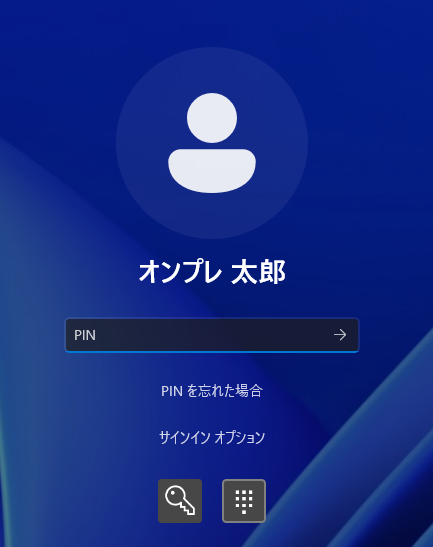

試しに、

「PINの最小文字数」を未構成から有効（10文字）に変更する

「PINの最大文字数」を未構成から有効（20文字）へ変更する。（もとのPINは９文字で設定）

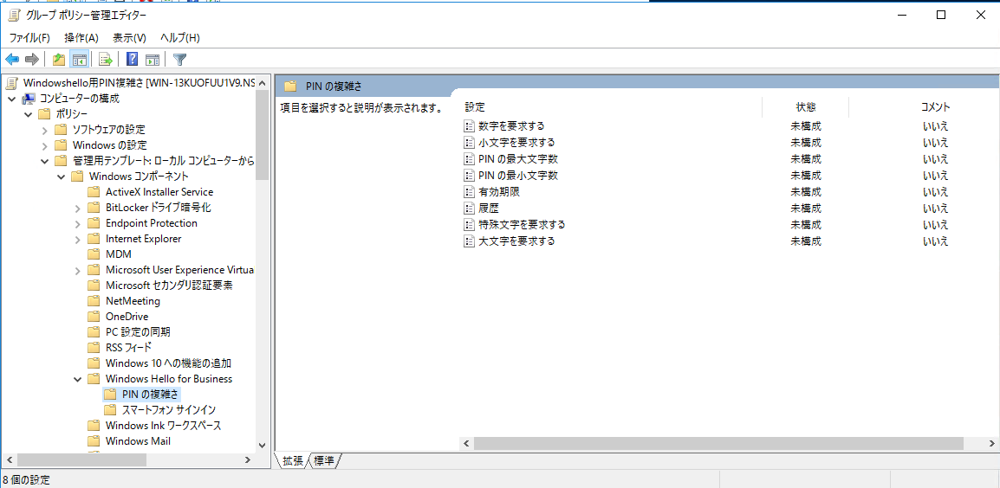

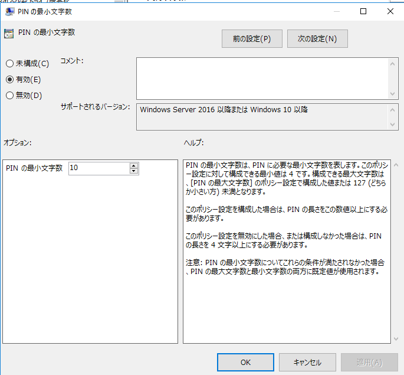

作成したGPOをLocalOUへ紐づけする

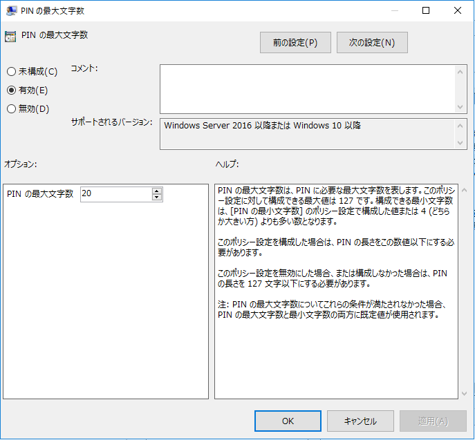

GPOが適用されるよう端末を再起動すると、変更したPINの要件に従い、変更するように要求されることが確認できる。

![image.png]../images/ドメイン参加端末のWindowshello/image21.png)

# 結論

### Windows hello の設定方法について

GPOで設定する。

| グループ ポリシー パス | グループ ポリシー設定 | 値 |
| --- | --- | --- |
| **コンピューターの構成\管理用テンプレート\システム\ログオン** | 便利なPINを使用したサインインをオンにする | 有効 |

### PINの複雑さの設定方法について

GPOで設定する。

既定値については、下記リンク先の既定値と明示されている箇所や 「このポリシー設定を無効にするか、構成しない場合～」 「このポリシー設定を構成しない場合～」 と記述されている箇所に記載がある。

https://learn.microsoft.com/ja-jp/windows/security/identity-protection/hello-for-business/policy-settings?tabs=pin#tabpanel_1_pin

| グループ ポリシー パス | グループ ポリシー設定 | 値 |
| --- | --- | --- |
| **コンピュータの構成\ポリシー\管理用テンプレート\Windows hello for business\PINの複雑さ** | PINの最大桁数、最小桁数など | 要件に合わせて設定 |
